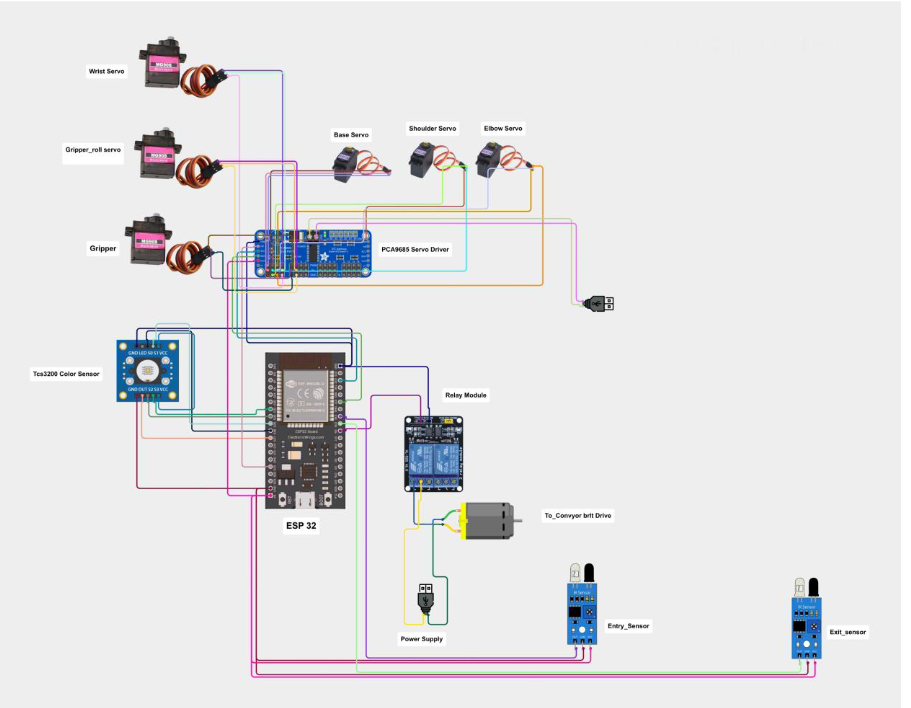

## ESP32-Based Robotic Arm with Conveyor Belt and Color Sorting System

<h1>## Author<h1>

Tanmay Patil  
automation and robotics Enginnering

## Project Overview

This project presents the design and implementation of an ESP32-based automated material handling system capable of detecting object color and sorting items using a robotic arm integrated with a conveyor belt mechanism. The system combines real-time color sensing, embedded processing, motor control, and mechanical automation to simulate an industrial sorting line.

The solution is developed as a compact and cost-effective prototype of an industrial automation system used in packaging, manufacturing, and recycling industries.

## Objective

To develop an intelligent automation system that:
- Detects object color in real time
- Controls conveyor movement
- Performs automated pick-and-place operation
- Sorts objects into designated bins without human intervention

## System Architecture

The system consists of the following main subsystems:

1. Sensing Unit – TCS3200 Color Sensor  
2. Processing Unit – ESP32 Microcontroller  
3. Material Handling Unit – DC Motor Driven Conveyor Belt  
4. Actuation Unit – Multi-DOF Servo-Based Robotic Arm  
5. Sorting Section – Color-Specific Bins  

Functional Flow:

Conveyor Belt → Color Detection → ESP32 Processing → Conveyor Stop → Robotic Arm Pick → Color-Based Placement → Conveyor Restart

## Detailed Working Mechanism

1. The conveyor belt continuously moves objects toward the sensing area.
2. When an object reaches the detection point, the ESP32 temporarily stops the conveyor motor.
3. The TCS3200 sensor measures RGB frequency values.
4. The ESP32 processes the frequency signals using predefined threshold logic.
5. Based on the detected color (Red/Green/Blue), a motion sequence is executed.
6. Servo motors drive the robotic arm to:
   - Position above the object
   - Activate the gripper
   - Lift the object
   - Rotate toward the specific bin
   - Release the object
7. The robotic arm returns to its home position.
8. The conveyor restarts for the next object.

## Hardware Components

- ESP32 Development Board  
- TCS3200 Color Sensor Module  
- Servo Motors (3–4 DOF Robotic Arm)  
- DC Motor for Conveyor Belt  
- Motor Driver Module (L298N or equivalent)  
- Robotic Arm Mechanical Structure  
- Conveyor Belt Assembly  
- Regulated Power Supply (5V/12V)  
- Sorting Bins  

## Software and Control Strategy

- Arduino IDE (ESP32 Board Package)
- Embedded C/C++ Programming
- PWM-based Servo Control
- DC Motor Speed Control using Motor Driver
- Frequency Measurement Algorithm
- Threshold-Based Color Classification Logic

The ESP32 provides enhanced processing speed, multiple PWM channels, and future IoT integration capability compared to traditional microcontrollers.

## Technical Highlights

- Real-time embedded automation system  
- Integrated conveyor control logic  
- Multi-actuator synchronization  
- Efficient PWM-based motor control  
- Scalable architecture for industrial extension  
- Wi-Fi and Bluetooth capability for future expansion  

## Industrial Relevance

This system closely resembles industrial automated sorting lines used in:

- Manufacturing industries  
- Packaging plants  
- Agricultural product grading  
- Recycling plants  
- Warehouse automation  

## Future Enhancements

- IoT dashboard for production monitoring  
- AI-based object recognition using camera module  
- Cloud data logging  
- Weight-based sorting integration  
- Closed-loop feedback using encoders  
- Industrial-grade robotic actuators  

## Educational Impact

This project demonstrates:

- Embedded system design using ESP32  
- Sensor interfacing techniques  
- Conveyor belt motor control  
- Servo-based robotic manipulation  
- Industrial automation concepts  
- Mechatronics system integration  

It bridges theoretical automation  knowledge with real-world automation implementation.

